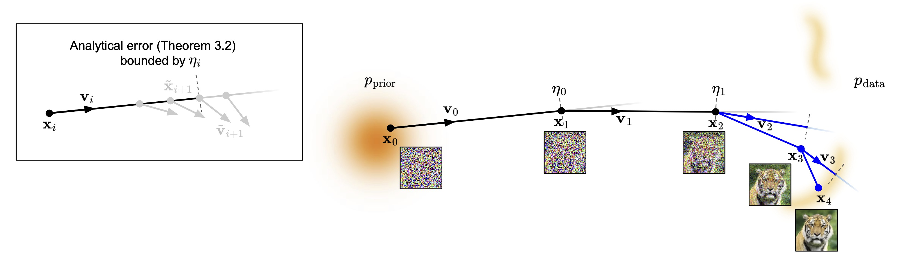

## Formalizing the Sampling Design Space of Diffusion-Based Generative Models via Adaptive Solvers and Wasserstein-Bounded Timesteps (SDM)



This repository provides the official implementation of SDM. Our method introduces a unified framework for diffusion sampling through adaptive solvers and Wasserstein-bounded adaptive scheduling.

## Getting started
You can set up the environment and install the required dependencies using the following commands

```.bash
# create a new conda environment
conda create -n sdm
conda activate sdm 

# install dependencies
pip install -r requirements.txt
```

## Sampling 
The SDM framework consists of two core components: **Adaptive Solver** and **Adaptive Scheduling**. You can use them individually or integrate them for optimal performance. We provide guidelines for unconditional and conditional generation settigs, but identical procedure can be followed when applying to modern ODE samplers (`dpmsolver_scripts`/`unipc_scripts`), high-resolution synthesis (`edm2_scripts`), and text-to-image generation tasks (`bash_t2i_scripts`).

### Adaptive Solver 
The adaptive solver dynamically adjusts solver allocation based on given threshold.

Edit `bash_scripts/test_scripts/test_afhqv2.sh` with your desired configuration:

```.bash
# test_afhqv2.sh

SCHEDULE="step"
TAUK=1e-4
python test.py \
    --exp $EXP --dataset_name afhqv2 --batch_size 128 \
    --model_weights_pkl edm/edm-afhqv2-64x64-uncond-vp.pkl \
    --channel_size 3 --image_size 64 \
    --num_steps 40 --discretization edm --sigma_min 0.002 --sigma_max 80 --rho 7.0 \
    --sampler_name sdm_solver --save_dir $SAVE_DIR --num_samples 50000 \
    --tau_k $TAUK --lambda_schedule $SCHEDULE \
    --save_images \
    --seed 42
```

And execute by running the following command.

```.bash
# adaptive solver
bash bash_scripts/test_scripts/test_afhqv2.sh 
```

### Adaptive Scheduling 
Adaptive scheduling method is composed of an initial eta-based scheduling followed by N-step resampling procedure.

**Pipeline Overview**
- Initial Scheduling: Generate an $\eta$-based initial schedule.
- N-step Resampling: Perform resampling to optimize the time steps
- Inference: Generate final images using the N-step resampled schedule.

```.bash
# adaptive_scheduling.sh

ETA_MIN=0.02
ETA_MAX=0.20
ETA_P=1.0
Q=0.25

# (1) initial eta-based scheduling
python test.py \
    --exp $EXP --dataset_name afhqv2 --batch_size 128 \
    --model_weights_pkl edm/edm-afhqv2-64x64-uncond-vp.pkl \
    --channel_size 3 --image_size 64 \
    --num_steps 40 --discretization edm --sigma_min 0.002 --sigma_max 80 --rho 7.0 \
    --sampler_name sdm_scheduler --solver $SOLVER --save_dir $SAVE_DIR --num_samples 50000 \
    --eta_min $ETA_MIN --eta_max $ETA_MAX --eta_p $ETA_P \
    --seed 42

# (1.5) parse optimized_num_steps from EXP dir, or manually set INIT_NUM_STEPS
local INIT_NUM_STEPS
INIT_NUM_STEPS=$(extract_steps_from_exp "${EXP}")
echo "[${EXP}] optimized_num_steps = ${INIT_NUM_STEPS}"

# (2) (optional) visualize eta values for initial schedule
python n_step_resampling.py \
    --dataset_name afhqv2 --batch_size 128 \
    --model_weights_pkl edm/edm-afhqv2-64x64-uncond-vp.pkl \
    --channel_size 3 --image_size 64 \
    --num_steps $INIT_NUM_STEPS --discretization edm --sigma_min 0.002 --sigma_max 80 --rho 7.0 \
    --solver $SOLVER --save_dir $SAVE_DIR --num_samples 50000 \
    --optimized_sigmas_save_dir $SAVE_DIR --optimized_sigmas_exp $EXP --load_optimized_sigmas \
    --save_plot \
    --seed 42

# (3) n-step resampling
python n_step_resampling.py \
    --exp $N_STEP_EXP --dataset_name afhqv2 --batch_size 128 \
    --model_weights_pkl edm/edm-afhqv2-64x64-uncond-vp.pkl \
    --channel_size 3 --image_size 64 \
    --num_steps $INIT_NUM_STEPS --discretization edm --sigma_min 0.002 --sigma_max 80 --rho 7.0 \
    --solver $SOLVER --save_dir $SAVE_DIR --num_samples 50000 \
    --optimized_sigmas_save_dir $SAVE_DIR --optimized_sigmas_exp $EXP --load_optimized_sigmas \
    --n_step_resampling \
    --resampled_num_steps 40 --power 0.5 --q $Q \
    --seed 42

# (4) (optional) visualize eta values for resampled schedule
python n_step_resampling.py \
    --dataset_name afhqv2 --batch_size 128 \
    --model_weights_pkl edm/edm-afhqv2-64x64-uncond-vp.pkl \
    --channel_size 3 --image_size 64 \
    --num_steps 40 --discretization edm --sigma_min 0.002 --sigma_max 80 --rho 7.0 \
    --solver $SOLVER --save_dir $SAVE_DIR --num_samples 50000 \
    --optimized_sigmas_save_dir $SAVE_DIR --optimized_sigmas_exp $N_STEP_EXP --load_optimized_sigmas \
    --save_plot \
    --seed "${SEED}"

# (5) generate images for FID using the resampled schedule
python test.py \
    --exp $N_STEP_EXP --dataset_name afhqv2 --batch_size 128 \
    --model_weights_pkl edm/edm-afhqv2-64x64-uncond-vp.pkl \
    --channel_size 3 --image_size 64 \
    --num_steps 40 --discretization edm --sigma_min 0.002 --sigma_max 80 --rho 7.0 \
    --sampler_name euler --save_dir $SAVE_DIR --num_samples 50000 \
    --optimized_sigmas_exp $N_STEP_EXP --load_optimized_sigmas \
    --save_images \
    --seed 42
```

The optimized timestep schedules are obtained by running the provided script.

```.bash
# adaptive scheduling
bash bash_scripts/test_scripts/adaptive_scheduling.sh 
```

Both sampling methods can be integrated as the following script, by running adaptive solver script on top of SDM optimized schedules. We provide an example configuration for step scheduler function. 

```.bash
# test_afhqv2.sh

# lambda function - step
SCHEDULE="step"
TAUK=1e-4
python test.py \
    --exp $EXP --dataset_name afhqv2 --batch_size 128 \
    --model_weights_pkl edm/edm-afhqv2-64x64-uncond-vp.pkl \
    --channel_size 3 --image_size 64 \
    --num_steps 40 --discretization edm --sigma_min 0.002 --sigma_max 80 --rho 7.0 \
    --sampler_name sdm_solver --save_dir $SAVE_DIR --num_samples 50000 \
    --optimized_sigmas_exp $N_STEP_EXP --load_optimized_sigmas \
    --tau_k $TAUK --lambda_schedule $SCHEDULE \
    --save_images \
    --seed 42
```
```.bash
# adaptive solver
bash bash_scripts/test_scripts/test_afhqv2.sh 
```

## Evaluation & Metrics 

### Fréchet Inception Distance (FID)
To evaluate the quality of the generated images, first generate 50,000 samples using the instructions above, then run the following command.

```.bash
bash bash_scripts/fid.sh
```

### Proxy Curvature Analysis
We provide tools to calculate the Proxy Curvature as discussed in the paper to analyze the geometric properties of the sampling trajectory.

```.bash
# calc_curvature.sh 

python test.py \
    --exp $EXP --dataset_name afhqv2 --batch_size 32 \
    --model_weights_pkl edm/edm-afhqv2-64x64-uncond-vp.pkl \
    --channel_size 3 --image_size 64 \
    --num_steps 40 --discretization edm --sigma_min 0.002 --sigma_max 80 --rho 7.0 \
    --sampler_name sdm_solver --num_samples 32 --save_dir $SAVE_DIR \
    --tau_k 0.0 \
    --calc_curvature \
    --seed 42

python calc_curvature.py \
    --jsonl_path $JSON_PATH \
    --output_path $OUTPUT_PATH
```

```.bash
bash bash_scripts/calc_curvature.sh
```